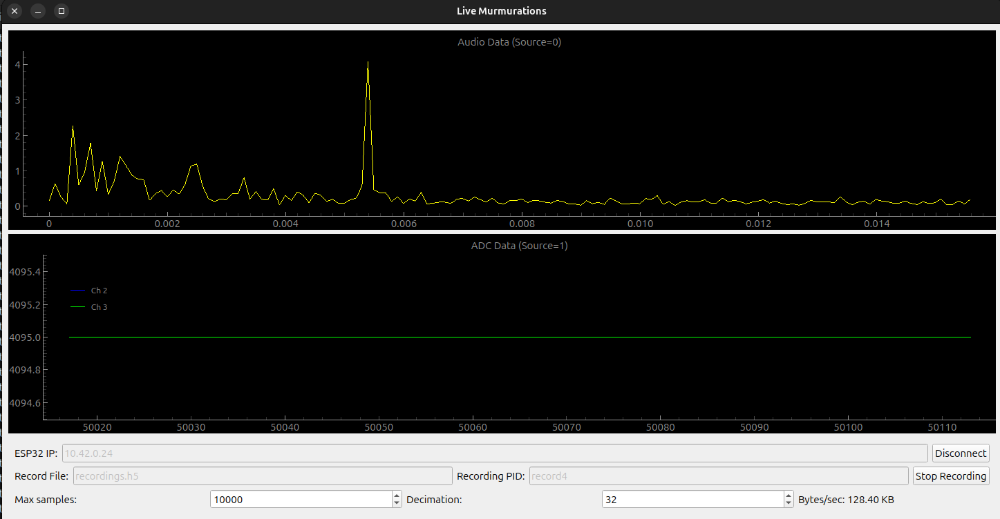
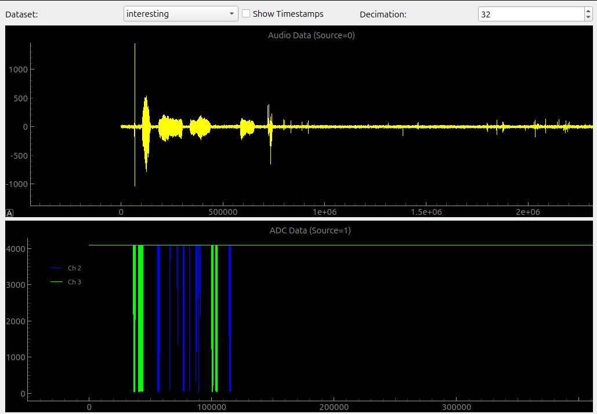

# Software

This folder includes utilities for capturing and inspecting data.

# live.py Application Breakdown

The **live.py** app is a PyQt5-based graphical interface that connects to the ESP32 streaming device. It displays incoming audio and ADC data in real time and offers options for data recording. The main features include:

- **Connection Setup:**  
  - By default, the app attempts to connect to the ESP32 at IP address `192.168.41.114` on port `5000`.  
  - Enter the correct ESP32 IP in the provided text field and click **Connect** to establish the connection.

- **Data Visualization:**  
  - Two plots are available:
    - **Audio Plot (Source=0):** Displays real-time microphone data.
    - **ADC Plot (Source=1):** Shows ADC channel data with each channel plotted in a different color.
  - Use the decimation and maximum sample controls to adjust the plot resolution and performance.

- **Data Recording:**  
  - Toggle recording with the **Record** button.  
  - Specify a filename (e.g., `recordings.h5`) and recording PID if desired.  
  - When enabled, the app saves incoming data (with timestamps and channel information) to an HDF5 file.

- **Performance Monitoring:**  
  - A “Bytes/sec” label shows the current data throughput.

## How to Use the App

1. **Set the ESP32 IP:**  
   - Enter your ESP32's IP address in the **ESP32 IP** field (default is `192.168.41.114`).

2. **Connect to the ESP32:**  
   - Click **Connect**. The app will establish a TCP connection and start receiving data.
   - The connection status, along with real-time plots for audio and ADC data, will update automatically.

3. **Record Data (Optional):**  
   - Enter a filename and PID in the recording fields.
   - Click **Record** to start saving data to the specified HDF5 file. Click again to stop recording.

4. **Adjust Display Settings:**  
   - Modify the **Decimation** factor and **Max Samples** settings to control the plotting performance and resolution.

5. **Disconnect:**  
   - Click **Disconnect** to safely close the connection to the ESP32.

## recorded.py Application Breakdown

This application is a PyQt5-based tool designed to inspect and visualize data recorded in an HDF5 file. It processes and displays two types of data:
- **Audio Data (Source 0):** Plotted as a continuous waveform.
- **ADC Data (Source 1):** Plotted per channel with each channel in a distinct color.

**Key Features:**
- **Data Processing:**  
  Helper functions separate and concatenate audio samples and ADC channel data from the recorded dataset.  
- **Interactive Visualization:**  
  Two plots (audio and ADC) display the data with a movable vertical line that snaps to event boundaries. This allows you to view timestamps and other event info near each selected point.
- **Dataset Selection & Decimation:**  
  A combo box lets you select the dataset to view, and a decimation control adjusts the display resolution.

## How to Use the App

1. **Launch the App:**  
   Run the script. A file dialog will prompt you to select an HDF5 file containing your recordings.

2. **Select a Dataset:**  
   Once a file is opened, use the dataset dropdown to choose which dataset to inspect.

3. **Adjust Plot Settings:**  
   - **Decimation:** Change the decimation factor (via the spin box) to control how many data points are shown—this helps improve performance with large datasets.
   - **Vertical Lines:**  
     Move the vertical lines on either plot to snap to the nearest event boundary. The app displays associated local and data timestamps to help you pinpoint specific events.

4. **Explore Your Data:**  
   The audio plot displays the waveform from source 0, and the ADC plot shows data for each channel from source 1. Use these interactive controls to analyze the recordings.
